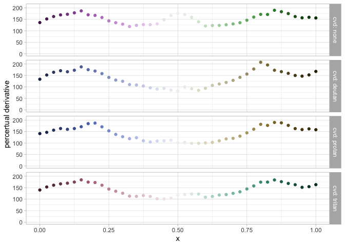
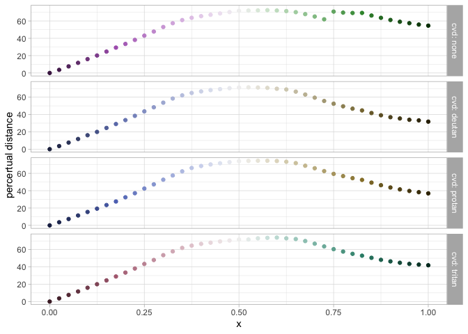

<!-- README.md is generated from README.Rmd. Please edit that file -->

# paleval

<!-- badges: start -->

[](https://CRAN.R-project.org/package=paleval)
[](https://www.tidyverse.org/lifecycle/#experimental)
[](https://travis-ci.org/ijlyttle/paleval)
[](https://codecov.io/gh/ijlyttle/paleval?branch=master)
<!-- badges: end -->

The goal of paleval is to help you evaluate the effectiveness of color
palettes and color maps. It builds from the
[colorspace](http://colorspace.r-forge.r-project.org) package, used to
design color maps, and the [farver](https://github.com/thomasp85/farver)
package, used to evaluate the perceptual difference between two colors.

This will have to go into a design-document eventually, but for now,
I’ll “puke” this here.

For the purpose of this package, following `colorRamp` and ggplot2
usage, we define some classes:

  - **`pev_fcont`**: A function that describes a continuous palette.
    When called with a numeric vector with values between 0 and 1, it
    returns a vector of the corresponding (hex-code) values.

  - **`pev_fdisc`**: A function that describes a discrete palette. When
    called with a single integer argument (the number of levels in the
    scale), it returns a vector of the (hex-code) value for the entire
    scale. There are two types of discrete-palette functions:
    
      - **`pev_bounded`**: Indicates that there is an upper-bound on the
        number of colors it can provide, e.g.
        [Tableau 10](https://www.tableau.com/about/blog/2016/7/colors-upgrade-tableau-10-56782).
        You would *not* think to interpolate between these colors.
    
      - **`pev_unbounded`**: Indicates that there is *no* upper-bound on
        the number of colors it can provide, e.g.
        [Tableau 10](https://www.tableau.com/about/blog/2016/7/colors-upgrade-tableau-10-56782).
        You might think to interpolate between these colors.

These follow the `palette` argument for
[`ggplot2::continuous_scale()`](https://ggplot2.tidyverse.org/reference/continuous_scale.html)
and
[`ggplot2::discrete_scale()`](https://ggplot2.tidyverse.org/reference/discrete_scale.html),
as well as `graphics::colorRamp()` and `graphics::colorRampPalette()`,
respectively.

I’m suspect I’m doing things in a way that the authors of `colorspace`,
`ggplot2`, `farver`, and `graphics` might prefer not to consider while
eating. As much as anything, this package is an attempt to reationalize
and harmonize all of these concepts to myself.

There are ways to create continuous-palette functions:

  - `pev_fcont()`: constructor
      - takes a vector (more than one) of hex-colors to be interpolated.
      - takes a (one) name of a colorspace palette.
      - takes a set of HCL parameters, following the colorspace
        framework.
      - takes a function.
      - takes a `pev_fcont` (no-op).
  - `pev_fcont_cvd()`: modifies the output of the palette function
    according to color-vision deficiency.
  - `pev_fcont_diverging()`: composes two continuous-palette functions
    to create (presumably) a diverging palette-function. It’s up to you
    to make sure the constituent palettes “meet in the middle”.
  - `pev_fcont_rescale()`: rescaling an existing continuous-palette
    function. It may make sense to “zoom-in”, but “zooming-out” could
    get you into trouble.
  - `pev_fcont_reverse()`: reverses the sense of the palette function.

There are ways to create discrete-palette functions:

  - `pev_fdisc()`: constructor
    
      - takes a vector of hex-colors, returns a **bounded** function.
      - takes a `pev_fcont`, given a discretization `method` (e.g.
        `"panel"` or `"post"`), returns an **unbounded** function.
      - takes a `pev_fdisc` (no-op).

  - `pev_fdisc_cvd()`: modifies the output of the palette function
    according to color-vision deficiency.

  - `pev_fdisc_reverse()`: reverses the sense of the palette function.

  - `print()`: prints a representation of the palette function.

Other functions:

  - `pev_nmax()`: get the maximum length supported by a discrete-palette
    function

  - `pev_hex_distance()`: given two (sets of) hex-colors, `hex`,
    `hex_ref`:
    
      - return the perceptual `distance` between them

  - `pev_data_separation()`: assess color-separation, given a
    discrete-palette function,
    
      - return `data.frame` with `cvd`, `i`, `hex`, `hex_ref`,
        `distance`

  - `pev_gg_separation()`

  - `pev_data_derivative()`: assess perceptual-derivative, given a
    continuous-palette function,
    
      - return `data.frame` with `cvd`, `x`, `hex`, `d_distance_d_x`

  - `pev_gg_derivative()`

  - `pev_data_distance()`: assess perceptual-distance from a
    reference-color, given a continuous-palette function,
    
      - return `data.frame` with `cvd`, `x`, `hex`, `hex_ref`,
        `distance`

  - `pev_gg_distance()`

  - `pev_data_spectrum()`: assess HCL and RGB spectrum for
    continuous-palette functions, given a continuous-palette function,
    
      - return `data.frame` with `x`, `dimension`, `value`

  - `pev_data_spectrum_hex()`
    
      - return `data.frame` with `x`, `dimension`, `value`, `hex_ref`

  - `pev_gg_spectrum()`

  - `pev_gg_bloom()`

## Installation

You can install the development version of paleval from
[GitHub](https://github.com/ijlyttle/paleval) with:

``` r
devtools::install_github("ijlyttle/paleval")
```

<!--
You can install the released version of paleval from [CRAN](https://CRAN.R-project.org) with:

``` r
install.packages("paleval")
```
-->

## Example

``` r
library("paleval")

fcont <- pev_fcont("Dynamic") # continuous palette-function, from colorspace
fdisc <- pev_fdisc(fcont, method = "panel") # discrete palette-function

data_sep <- pev_data_separation(fdisc(7))
print(data_sep)
#> # A tibble: 196 x 5
#>    cvd       i hex     hex_ref distance
#>    <chr> <int> <chr>   <chr>      <dbl>
#>  1 none      1 #E396A0 #E396A0      0  
#>  2 none      1 #E396A0 #D796D0     14.9
#>  3 none      1 #E396A0 #9FA8E2     26.4
#>  4 none      1 #E396A0 #4CB9CC     53.6
#>  5 none      1 #E396A0 #50BE9B     53.0
#>  6 none      1 #E396A0 #97B56C     45.3
#>  7 none      1 #E396A0 #CBA56E     27.1
#>  8 none      2 #D796D0 #E396A0     14.9
#>  9 none      2 #D796D0 #D796D0      0  
#> 10 none      2 #D796D0 #9FA8E2     18.3
#> # … with 186 more rows

pev_gg_separation(data_sep)
```


``` r
data_drv <- pev_data_derivative("Purple-Green")
data_drv
#> # A tibble: 164 x 4
#>    cvd       x hex     d_distance_d_x
#>    <chr> <dbl> <chr>            <dbl>
#>  1 none  0     #492050           136.
#>  2 none  0.025 #562A5E           152.
#>  3 none  0.05  #65346D           162.
#>  4 none  0.075 #733F7C           169.
#>  5 none  0.1   #82498C           172.
#>  6 none  0.125 #90529C           178.
#>  7 none  0.15  #9F5CAB           187.
#>  8 none  0.175 #AE65BB           170.
#>  9 none  0.2   #B574C2           167.
#> 10 none  0.225 #BD82C9           158.
#> # … with 154 more rows

pev_gg_derivative(data_drv)
```



``` r
data_dist <- pev_data_distance("Purple-Green")
data_dist
#> # A tibble: 164 x 5
#>    cvd       x hex     hex_ref distance
#>    <chr> <dbl> <chr>   <chr>      <dbl>
#>  1 none  0     #492050 #492050     0   
#>  2 none  0.025 #562A5E #492050     3.59
#>  3 none  0.05  #65346D #492050     7.58
#>  4 none  0.075 #733F7C #492050    11.7 
#>  5 none  0.1   #82498C #492050    16.0 
#>  6 none  0.125 #90529C #492050    20.1 
#>  7 none  0.15  #9F5CAB #492050    24.7 
#>  8 none  0.175 #AE65BB #492050    29.2 
#>  9 none  0.2   #B574C2 #492050    33.5 
#> 10 none  0.225 #BD82C9 #492050    38.1 
#> # … with 154 more rows

pev_gg_distance(data_dist)
```



## Code of Conduct

Please note that the ‘paleval’ project is released with a [Contributor
Code of Conduct](CODE_OF_CONDUCT.md). By contributing to this project,
you agree to abide by its terms.
