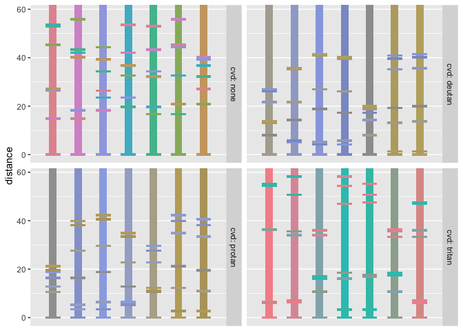

<!-- README.md is generated from README.Rmd. Please edit that file -->

# paleval

<!-- badges: start -->

[](https://CRAN.R-project.org/package=paleval)
[](https://www.tidyverse.org/lifecycle/#experimental)
[](https://travis-ci.org/ijlyttle/paleval)
[](https://codecov.io/gh/ijlyttle/paleval?branch=master)
<!-- badges: end -->

The goal of paleval is to help you evaluate the effectiveness of color
palettes and color maps. It builds from the
[colorspace](http://colorspace.r-forge.r-project.org) package, used to
design color maps, and the [farver](https://github.com/thomasp85/farver)
package, used to evaluate the perceptual difference between two colors.

For the purpose of this package, we define:

  - **palette**: a collection of colors intended for use with
    categorical data. Order is used for familiarity, rather than to
    imply order among observations of the encoded variable.
    Interpolation within a palette is not required to be a well-formed
    idea.

  - **map**: an ordered collection of colors intended for use with
    numerical data, or for data where we wish to imply order among
    observations of the encoded variable. We expect to be able to
    interpolate within a map.

## Installation

You can install the development version of paleval from
[GitHub](https://github.com/ijlyttle/paleval) with:

``` r
devtools::install_github("ijlyttle/paleval")
```

<!--
You can install the released version of paleval from [CRAN](https://CRAN.R-project.org) with:

``` r
install.packages("paleval")
```
-->

## Example

``` r
library("paleval")

pal <- colorspace::qualitative_hcl(n = 5)
print(pal)
#> [1] "#E16A86" "#AA9000" "#00AA5A" "#00A6CA" "#B675E0"

data_sep <- pev_data_separation(pal)
print(data_sep)
#> # A tibble: 25 x 3
#>    color_a color_b difference
#>    <chr>   <chr>        <dbl>
#>  1 #E16A86 #E16A86        0  
#>  2 #E16A86 #AA9000       48.6
#>  3 #E16A86 #00AA5A       71.4
#>  4 #E16A86 #00A6CA       60.3
#>  5 #E16A86 #B675E0       23.0
#>  6 #AA9000 #E16A86       48.6
#>  7 #AA9000 #AA9000        0  
#>  8 #AA9000 #00AA5A       30.4
#>  9 #AA9000 #00A6CA       47.7
#> 10 #AA9000 #B675E0       63.9
#> # … with 15 more rows

pev_gg_separation(data_sep)
```



## Code of Conduct

Please note that the ‘paleval’ project is released with a [Contributor
Code of Conduct](CODE_OF_CONDUCT.md). By contributing to this project,
you agree to abide by its terms.
