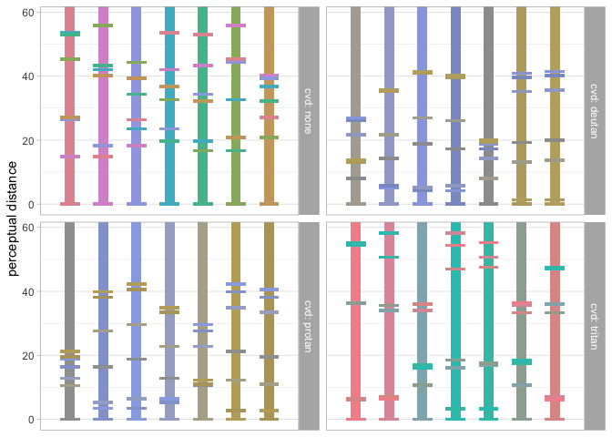

<!-- README.md is generated from README.Rmd. Please edit that file -->

# paleval

<!-- badges: start -->

[](https://CRAN.R-project.org/package=paleval)
[](https://www.tidyverse.org/lifecycle/#experimental)
[](https://travis-ci.org/ijlyttle/paleval)
[](https://codecov.io/gh/ijlyttle/paleval?branch=master)
<!-- badges: end -->

The goal of paleval is to help you evaluate the effectiveness of color
palettes and color maps. It builds from the
[colorspace](http://colorspace.r-forge.r-project.org) package, used to
design color maps, and the [farver](https://github.com/thomasp85/farver)
package, used to evaluate the perceptual difference between two colors.

This will have to go into a design-document eventually, but for now,
I’ll “puke” this here.

For the purpose of this package, following ggplot2 usage, we define:

  - **`fpal_cont`**: A (palette) function that, when called with a
    numeric vector with values between 0 and 1, returns the
    corresponding (hex-code) values.

  - **`fpal_disc`**: A (palette) function that, when called with a
    single integer argument (the number of levels in the scale), returns
    the (hex-code) values that they should take. Such a function will
    have a maximum for the argument.

These follow the `palette` argument for
[`ggplot2::continuous_scale()`](https://ggplot2.tidyverse.org/reference/continuous_scale.html)
and
[`ggplot2::discrete_scale()`](https://ggplot2.tidyverse.org/reference/discrete_scale.html)

There are ways to create continuous-palette functions:

  - hcl, etc. parameters, following the colorspace framework.
    `pev_cont_hcl()`
  - composing two continuous-palette functions to create (presumably) a
    diverging palette-function. It’s up to you to make sure the
    constituent palettes “meet in the middle”. `pev_cont_compose()`
  - rescaling an existing continuous-palette function. It may make sense
    to “zoom-in”, but “zooming-out” could get you into trouble.
    `pev_cont_rescale()`

There are ways to create discrete-palette functions:

  - discretizing a contiuous-palette function, specifying number of
    colors and discretization method (e.g. panels or posts).
    `pev_disc_cont()`
  - supplying a vector of hex-codes. `pev_disc_hex()`

As well, it would be useful to have a function that, given an
`fpal_discrete`, returns the maximum-index.

## Installation

You can install the development version of paleval from
[GitHub](https://github.com/ijlyttle/paleval) with:

``` r
devtools::install_github("ijlyttle/paleval")
```

<!--
You can install the released version of paleval from [CRAN](https://CRAN.R-project.org) with:

``` r
install.packages("paleval")
```
-->

## Example

``` r
library("paleval")

pal <- colorspace::qualitative_hcl(n = 5)
print(pal)
#> [1] "#E16A86" "#AA9000" "#00AA5A" "#00A6CA" "#B675E0"

data_sep <- pev_data_separation(pal)
print(data_sep)
#> # A tibble: 100 x 4
#>    cvd   color_a color_b difference
#>    <chr> <fct>   <chr>        <dbl>
#>  1 none  #E16A86 #E16A86        0  
#>  2 none  #E16A86 #AA9000       48.6
#>  3 none  #E16A86 #00AA5A       71.4
#>  4 none  #E16A86 #00A6CA       60.3
#>  5 none  #E16A86 #B675E0       23.0
#>  6 none  #AA9000 #E16A86       48.6
#>  7 none  #AA9000 #AA9000        0  
#>  8 none  #AA9000 #00AA5A       30.4
#>  9 none  #AA9000 #00A6CA       47.7
#> 10 none  #AA9000 #B675E0       63.9
#> # … with 90 more rows

pev_gg_separation(data_sep)
```



## Code of Conduct

Please note that the ‘paleval’ project is released with a [Contributor
Code of Conduct](CODE_OF_CONDUCT.md). By contributing to this project,
you agree to abide by its terms.
